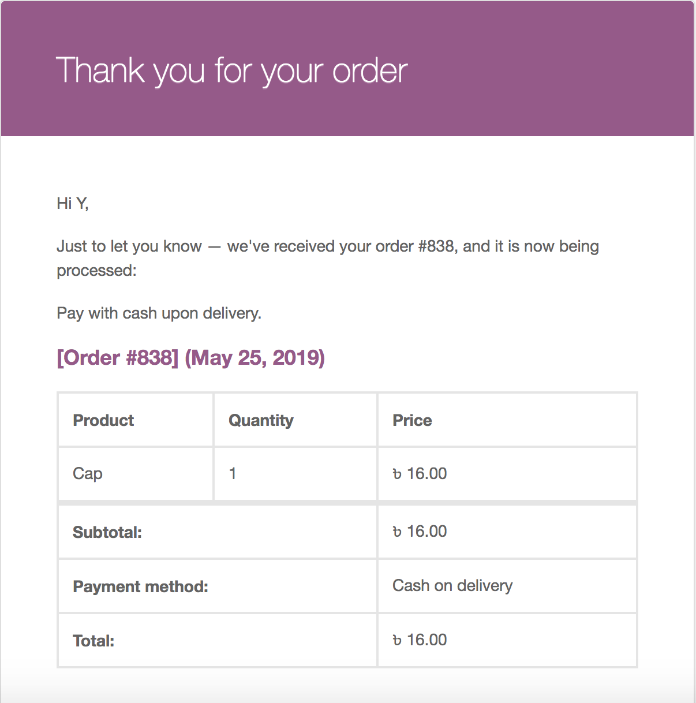
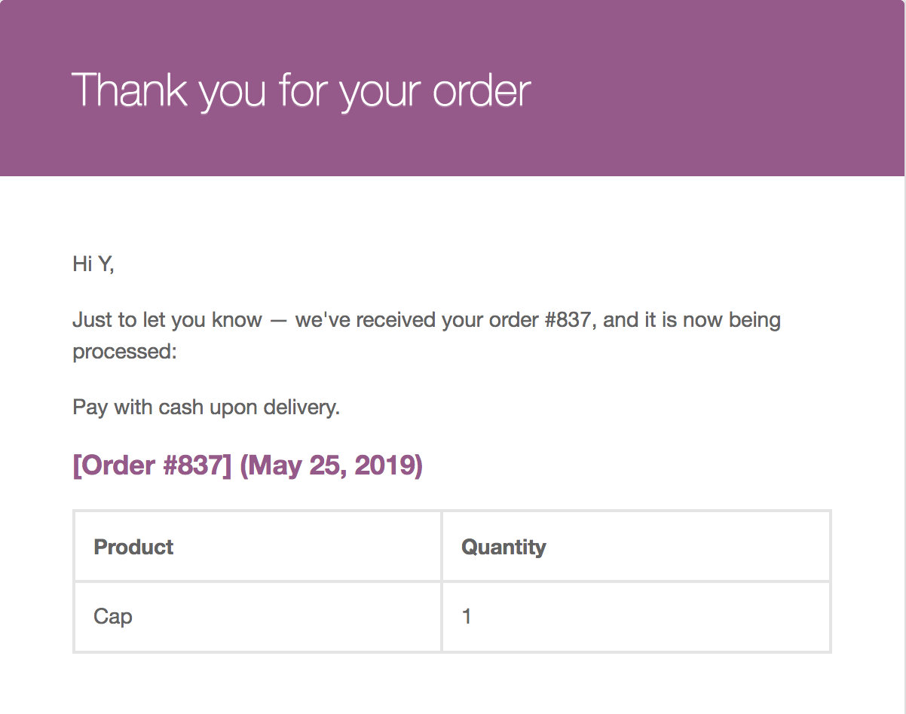

In this tutorial, I will show you how to hide price data from WooCommerce emails.

Let's just take a quick look at how the email will look like before and after the removal of price data.

## Before the removal of price data



## After the Removal of Price Data



## Method 1: Remove Price Data With CSS

Add the code below to your plugin or your active theme's functions.php

```
function ymcode_hide_shipping_row_with_css()
{
	?>
	<style>
		table table table table th:last-child,
		table table table table .order_item td:last-child,
		table table table table tfoot {
			display: none;
		}    	
    </style>
	<?php
}

add_action('woocommerce_email_header', 'ymcode_hide_shipping_row_with_css', 10, 0);
```

## Method 2: Remove Price Data by Editing the Template File

A better method is to place these two edited template files in the active theme's folder as WooCommerce suggests.

Place the code below in a file under your active theme's directory/woocomerce/emails/email-order-details.php

```
<?php
/**
 * Order details table shown in emails.
 *
 * This template can be overridden by copying it to yourtheme/woocommerce/emails/email-order-details.php.
 *
 * HOWEVER, on occasion WooCommerce will need to update template files and you
 * (the theme developer) will need to copy the new files to your theme to
 * maintain compatibility. We try to do this as little as possible, but it does
 * happen. When this occurs the version of the template file will be bumped and
 * the readme will list any important changes.
 *
 * @see https://docs.woocommerce.com/document/template-structure/
 * @package WooCommerce/Templates/Emails
 * @version 3.3.1
 */

if ( ! defined( 'ABSPATH' ) ) {
	exit;
}

$text_align = is_rtl() ? 'right' : 'left';

do_action( 'woocommerce_email_before_order_table', $order, $sent_to_admin, $plain_text, $email ); ?>

<h2>
	<?php
	if ( $sent_to_admin ) {
		$before = '<a class="link" href="' . esc_url( $order->get_edit_order_url() ) . '">';
		$after  = '</a>';
	} else {
		$before = '';
		$after  = '';
	}
	/* translators: %s: Order ID. */
	echo wp_kses_post( $before . sprintf( __( '[Order #%s]', 'woocommerce' ) . $after . ' (<time datetime="%s">%s</time>)', $order->get_order_number(), $order->get_date_created()->format( 'c' ), wc_format_datetime( $order->get_date_created() ) ) );
	?>
</h2>

<div style="margin-bottom: 40px;">
	<table class="td" cellspacing="0" cellpadding="6" style="width: 100%; font-family: 'Helvetica Neue', Helvetica, Roboto, Arial, sans-serif;" border="1">
		<thead>
			<tr>
				<th class="td" scope="col" style="text-align:<?php echo esc_attr( $text_align ); ?>;"><?php esc_html_e( 'Product', 'woocommerce' ); ?></th>
				<th class="td" scope="col" style="text-align:<?php echo esc_attr( $text_align ); ?>;"><?php esc_html_e( 'Quantity', 'woocommerce' ); ?></th>
			</tr>
		</thead>
		<tbody>
			<?php
			echo wc_get_email_order_items( $order, array( // WPCS: XSS ok.
				'show_sku'      => $sent_to_admin,
				'show_image'    => false,
				'image_size'    => array( 32, 32 ),
				'plain_text'    => $plain_text,
				'sent_to_admin' => $sent_to_admin,
			) );
			?>
		</tbody>
	</table>
</div>

<?php do_action( 'woocommerce_email_after_order_table', $order, $sent_to_admin, $plain_text, $email ); ?>
```

Place the code below in a file under your active theme's directory/woocomerce/emails/email-order-items.php

```
<?php
/**
 * Email Order Items
 *
 * This template can be overridden by copying it to yourtheme/woocommerce/emails/email-order-items.php.
 *
 * HOWEVER, on occasion WooCommerce will need to update template files and you
 * (the theme developer) will need to copy the new files to your theme to
 * maintain compatibility. We try to do this as little as possible, but it does
 * happen. When this occurs the version of the template file will be bumped and
 * the readme will list any important changes.
 *
 * @see     https://docs.woocommerce.com/document/template-structure/
 * @package WooCommerce/Templates/Emails
 * @version 3.5.0
 */

defined( 'ABSPATH' ) || exit;

$text_align  = is_rtl() ? 'right' : 'left';
$margin_side = is_rtl() ? 'left' : 'right';

foreach ( $items as $item_id => $item ) :
	$product       = $item->get_product();
	$sku           = '';
	$purchase_note = '';
	$image         = '';

	if ( ! apply_filters( 'woocommerce_order_item_visible', true, $item ) ) {
		continue;
	}

	if ( is_object( $product ) ) {
		$sku           = $product->get_sku();
		$purchase_note = $product->get_purchase_note();
		$image         = $product->get_image( $image_size );
	}

	?>
	<tr class="<?php echo esc_attr( apply_filters( 'woocommerce_order_item_class', 'order_item', $item, $order ) ); ?>">
		<td class="td" style="text-align:<?php echo esc_attr( $text_align ); ?>; vertical-align: middle; font-family: 'Helvetica Neue', Helvetica, Roboto, Arial, sans-serif; word-wrap:break-word;">
		<?php

		// Show title/image etc.
		if ( $show_image ) {
			echo wp_kses_post( apply_filters( 'woocommerce_order_item_thumbnail', $image, $item ) );
		}

		// Product name.
		echo wp_kses_post( apply_filters( 'woocommerce_order_item_name', $item->get_name(), $item, false ) );

		// SKU.
		if ( $show_sku && $sku ) {
			echo wp_kses_post( ' (#' . $sku . ')' );
		}

		// allow other plugins to add additional product information here.
		do_action( 'woocommerce_order_item_meta_start', $item_id, $item, $order, $plain_text );

		wc_display_item_meta(
			$item,
			array(
				'label_before' => '<strong class="wc-item-meta-label" style="float: ' . esc_attr( $text_align ) . '; margin-' . esc_attr( $margin_side ) . ': .25em; clear: both">',
			)
		);

		// allow other plugins to add additional product information here.
		do_action( 'woocommerce_order_item_meta_end', $item_id, $item, $order, $plain_text );

		?>
		</td>
		<td class="td" style="text-align:<?php echo esc_attr( $text_align ); ?>; vertical-align:middle; font-family: 'Helvetica Neue', Helvetica, Roboto, Arial, sans-serif;">
			<?php echo wp_kses_post( apply_filters( 'woocommerce_email_order_item_quantity', $item->get_quantity(), $item ) ); ?>
		</td>
	</tr>
	<?php

	if ( $show_purchase_note && $purchase_note ) {
		?>
		<tr>
			<td colspan="3" style="text-align:<?php echo esc_attr( $text_align ); ?>; vertical-align:middle; font-family: 'Helvetica Neue', Helvetica, Roboto, Arial, sans-serif;">
				<?php
				echo wp_kses_post( wpautop( do_shortcode( $purchase_note ) ) );
				?>
			</td>
		</tr>
		<?php
	}
	?>

<?php endforeach; ?>
```

## My Preferred Method

Hiding the price data with CSS is a quick and dirty way. However, you can never guarantee that it will work on every email client, which is why I prefer removing the data from template files.

Depending your need, you may decide which one to use. They both will work on major email clients.
